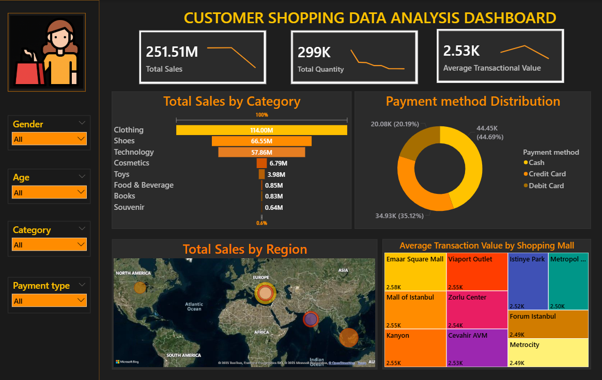

# 🛍️ **Customer Shopping Data Analysis**

-------------------------------------------------------------------------------------------------------------------------------------------------------------------

#### &nbsp;📊 **Project Overview**

-------------------------------------------------------------------------------------------------------------------------------------------------------------------

This Power BI project provides a comprehensive analysis of customer shopping behavior to understand sales performance, spending patterns, and store efficiency.

The dashboard visualizes key retail metrics like total sales, transaction count, average transaction value, customer distribution, and payment method trends — helping businesses make 

data-driven decisions to improve marketing and operations.

-------------------------------------------------------------------------------------------------------------------------------------------------------------------

#### 🧠 **Key Insights**

-------------------------------------------------------------------------------------------------------------------------------------------------------------------

**🏬 Top Performing Branches:** Identified which stores generate the highest revenue.

💳 **Payment Trends:** Analyzed the most used payment methods across branches.

📈 **Customer Behavior:** Found correlations between customer types, gender, and average purchase value.

🕒 **Sales Over Time:** Tracked how sales vary across hours and days of the week.

💰 **Profitability Analysis:** Examined product lines contributing most to profit.

----------------------------------------------------------------------------------------------------------------------------------------------------------------------------------------------------------------------------------------

#### **🗂️ Dataset Information**

-------------------------------------------------------------------------------------------------------------------------------------------------------------------

|   **Column Name**      |         **Description**                                               |

|--------------------------|--------------------------------------------------------- |

| **Invoice\_No**             |    Unique identifier for each transaction           |

| **Customer\_ID**          |   Unique ID assigned to each customer           |

| **Gender**                     |   Gender of the customer (Male / Female        |

| **Age**                           |    Age of the customer                                       |

| **Category**                  |    Product or shopping category                        |

| **Quantity**                   |   Number of items purchased                           |

| **Price**                         |    Price per item or total purchase price            |

| **Payment\_Method**   |    Mode of payment (Cash, Credit, UPI, etc.)  |

| **Invoice\_Date**           |    Date of the transaction                                    |

| **Shopping\_Mall**        |   Name of Shopping Mall                                  |

-------------------------------------------------------------------------------------------------------------------------------------------------------------------

#### 🧰 **Tools Used**

-------------------------------------------------------------------------------------------------------------------------------------------------------------------

* **Power BI Desktop**
* **Power Query** – for data cleaning and transformation
* **DAX (Data Analysis Expressions)** – for calculated measures and KPIs
* **Excel / CSV Dataset** – as the primary data source

-------------------------------------------------------------------------------------------------------------------------------------------------------------------

#### 📈 **Dashboard Features**

-------------------------------------------------------------------------------------------------------------------------------------------------------------------

**💰 Sales Overview -** Displays total sales, total transactions, and average order value. 

 **👥 Customer Insights -**  Analyzes customer demographics based on age and gender. 

 **🛒 Category Analysis -** Shows best-performing product categories and quantity sold. 

 **💳 Payment Insights -** Compares different payment methods used by customers. 

 **📅 Time-Based Trends -** Tracks sales over time (daily, monthly, or yearly trends). 

 **🌍 Geographical View -** Highlights top-performing cities or regions . 

 **📈 KPI Cards -** Displays key performance metrics such as total revenue, average price, and top category. 

 **🔍 Interactive Filters -** Allows users to filter data by category, gender, payment type, and shopping type. 

 **📊 Visual Variety -** Includes charts like bar graphs, donut charts, funnel, and KPI indicators for rich insights. 

-------------------------------------------------------------------------------------------------------------------------------------------------------------------

#### 📷 **Dashboard Preview**

-------------------------------------------------------------------------------------------------------------------------------------------------------------------

-------------------------------------------------------------------------------------------------------------------------------------------------------------------

#### 🧩 **Future Improvements**

-----------------------------------------------------------------------------------------------------------------------------------------------------------------

* **Predictive Analytics:** Integrate machine learning models to forecast future sales and customer spending behavior.
* **Geo-Mapping:** Add location-based visuals to analyze regional sales distribution.
* **Dynamic Filtering:** Enable advanced slicers and multi-level filters (e.g., filter by category and gender together).
* **Mobile Optimization:** Redesign visuals to ensure a smooth viewing experience on Power BI Mobile.
* **Real-Time Data Updates:** Connect to live data sources like SQL or APIs for automatic dashboard refresh.
* **Customer Sentiment Analysis:** Combine customer reviews or feedback to evaluate satisfaction and shopping experience.
* **Profitability Analysis:** Include cost and profit margin calculations to assess product and category-level profitability.
* 

#### 🏁 **Conclusion**

-------------------------------------------------------------------------------------------------------------------------------------------------------------------

This Power BI dashboard provides a complete view of customer shopping data — combining insights from demographics, purchasing behavior, and sales performance.

It serves as a valuable tool for retail businesses to enhance decision-making, improve marketing strategies, and maximize revenue opportunities.

